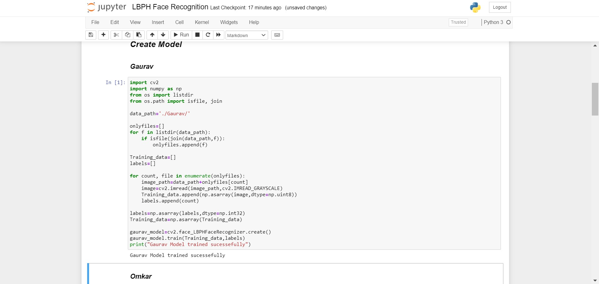
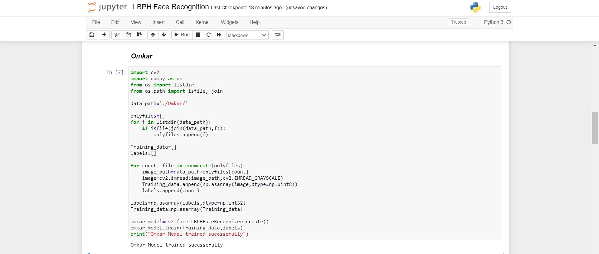
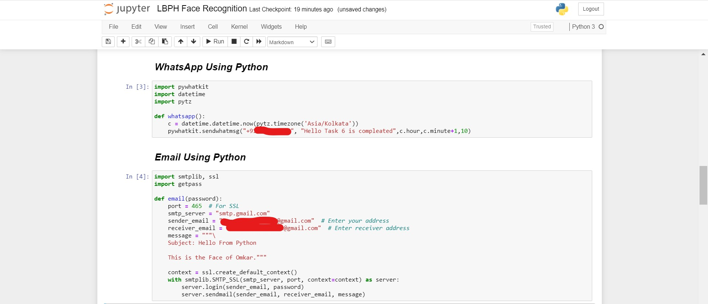
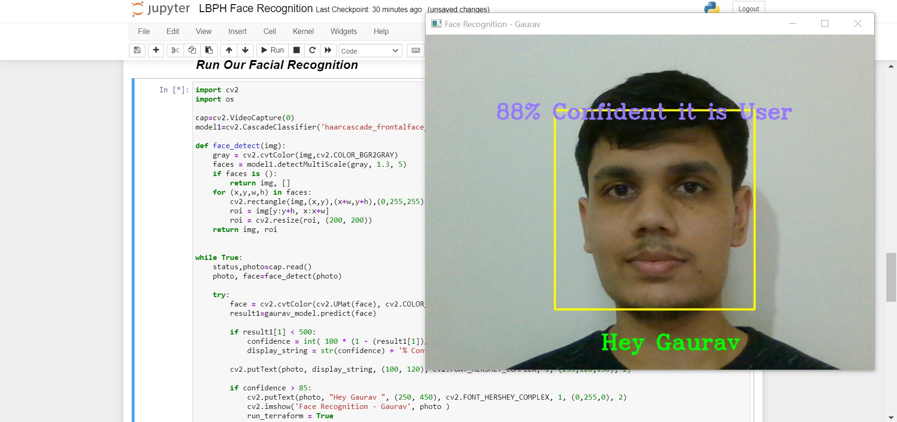
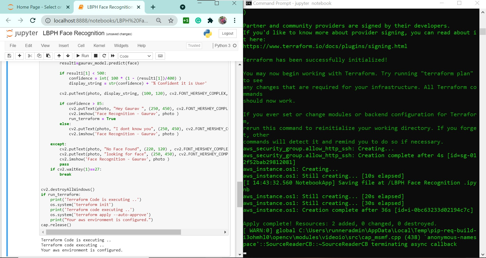
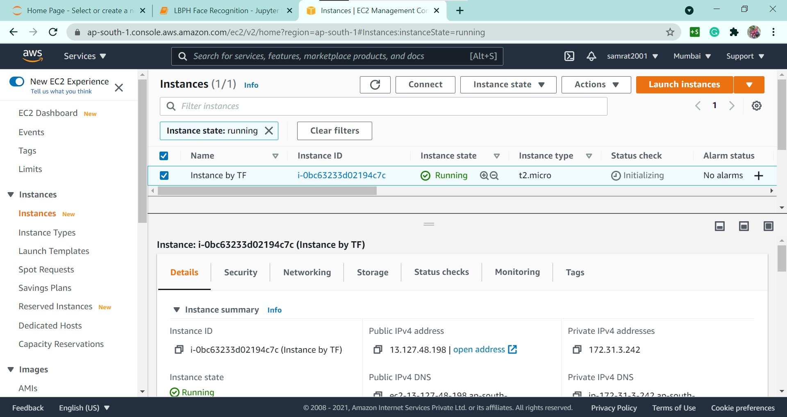
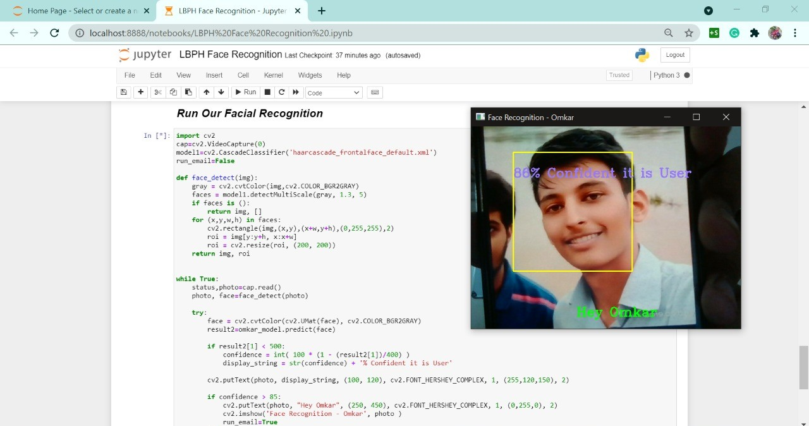
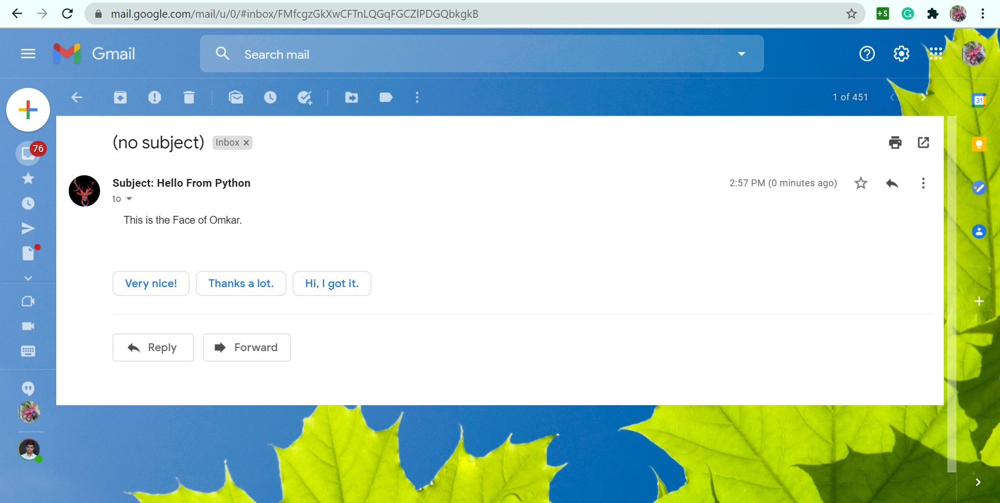
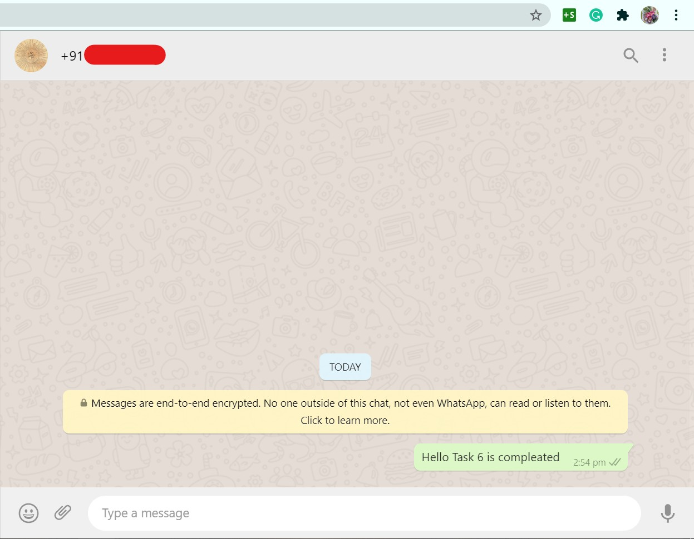

## ***Using Face Recognition to send a mail*** 📧***, WhatsApp*** 📲 ***and launching AWS instance*** 💻


> ***So In this task we are using the Face Recognition model to recognize someone's Face and after that we will ask the model to send a WhatsApp message to some friend's number, email to someone. for making this task more interesting we will Create one more model to recognize another person face. after there face is recognize we will ask the model to launch AWS ec2 instance via a terraform code.***

> ***Here for creating the face Recognition model we will be using LBPH (Local Binary Patterns Histogram) Algorithm. It is based on local binary operator. It is widely used in facial recognition due to its computational simplicity and discriminative power.***

### ***Task Description***

✨Create a program that perform below mentioned task upon recognizing a particular face.

📌 When it recognize your face then -
👉 It send mail to your mail id by writing this is face of your_name.
👉 Second it send whatsapp message to your friend, it can be anything.

📌 When it recognize second  face, it can be your friend or family members face.
👉 Create EC2 instance in the AWS using CLI.


### Step 1
Lets Collect the Data at the most. here we are collecting 100 images of both the person using the code ....
```
# Data collection for person 1
import cv2
model=cv2.CascadeClassifier('haarcascade_frontalface_default.xml')
cap=cv2.VideoCapture(0)

def face_detect(photo):
    face=model.detectMultiScale(photo,1.3,5)
    if len(face) != 0:
        for (x,y,w,h) in face:
            photo = photo[y:y+h,x:x+h]
        return photo
    else:
        return None  

count=0
while True:
    status,photo=cap.read()
    photo=cv2.cvtColor(photo,cv2.COLOR_BGR2GRAY)
    if face_detect(photo) is not None:
        count += 1
        photo=cv2.resize(face_detect(photo),(200,200))
        file_path = './Gaurav/' + str(count) + ".jpg"
        cv2.imwrite(file_path,photo)
        cv2.putText(photo, str(count), (50, 50), cv2.FONT_HERSHEY_COMPLEX, 1, (0,255,0), 2)
        cv2.imshow('hi',photo)
    else:
        pass
    if cv2.waitKey(1) == 27 or count>=100:
            break    

cv2.destroyAllWindows()
cap.release()
```
Similarly we can Collect data for person 2

### Step 2
Now lets Create and train model using captured images

```
# model training for person 1
import cv2
import numpy as np
from os import listdir
from os.path import isfile, join

data_path='./Gaurav/'

onlyfiles=[]
for f in listdir(data_path):
    if isfile(join(data_path,f)):
        onlyfiles.append(f)

Training_data=[]
labels=[]

for count, file in enumerate(onlyfiles):
    image_path=data_path+onlyfiles[count]
    image=cv2.imread(image_path,cv2.IMREAD_GRAYSCALE)
    Training_data.append(np.asarray(image,dtype=np.uint8))
    labels.append(count)

labels=np.asarray(labels,dtype=np.int32)
Training_data=np.asarray(Training_data)

gaurav_model=cv2.face_LBPHFaceRecognizer.create()
gaurav_model.train(Training_data,labels)
print("Gaurav Model trained sucessefully")
```

```
# model training for person 2
import cv2
import numpy as np
from os import listdir
from os.path import isfile, join

data_path='./Omkar/'

onlyfiles=[]
for f in listdir(data_path):
    if isfile(join(data_path,f)):
        onlyfiles.append(f)

Training_data=[]
labels=[]

for count, file in enumerate(onlyfiles):
    image_path=data_path+onlyfiles[count]
    image=cv2.imread(image_path,cv2.IMREAD_GRAYSCALE)
    Training_data.append(np.asarray(image,dtype=np.uint8))
    labels.append(count)

labels=np.asarray(labels,dtype=np.int32)
Training_data=np.asarray(Training_data)

omkar_model=cv2.face_LBPHFaceRecognizer.create()
omkar_model.train(Training_data,labels)
print("Omkar Model trained sucessefully")
```


### Step 3
Now lets Create functions to send the WhatsApp message and email

Fuction to send whatsapp message
```
import pywhatkit
import datetime
import pytz

def whatsapp():
    c = datetime.datetime.now(pytz.timezone('Asia/Kolkata'))
    pywhatkit.sendwhatmsg("+91*********", "Hello Task 6 is compleated",c.hour,c.minute+1,10)
```
Fuction to send email
```
import smtplib, ssl
import getpass

def email(password):
    port = 465  # For SSL
    smtp_server = "smtp.gmail.com"
    sender_email = "****************@gmail.com"  # Enter your address
    receiver_email = "**************@gmail.com"  # Enter receiver address
    message = """\
    Subject: Hello From Python

    This is the Face of Omkar."""

    context = ssl.create_default_context()
    with smtplib.SMTP_SSL(smtp_server, port, context=context) as server:
        server.login(sender_email, password)
        server.sendmail(sender_email, receiver_email, message)
```

### Step 4
Now lets create the terraform code to launch the AWS ec2 instance

```main.tf```

```
provider "aws" {
    region = "ap-south-1"
    profile = "gaurav"        
}

resource "aws_security_group" "allow_http_ssh" {
  name        = "allow_http_ssh"
  description = "Allow HTTP and SSH inbound traffic"

  ingress {
    description = "Allow Traffic from port 80"
    from_port   = 80
    to_port     = 80
    protocol    = "tcp"
    cidr_blocks = ["0.0.0.0/0"]
  }
  ingress {
    description = "Allow Traffic from port 22"
    from_port   = 22
    to_port     = 22
    protocol    = "tcp"
    cidr_blocks = ["0.0.0.0/0"]
  }
  egress {
    from_port   = 0
    to_port     = 0
    protocol    = "-1"
    cidr_blocks = ["0.0.0.0/0"]
  }

  tags = {
    Name = "allow_80_n_22_n_2049"
  }
}

resource "aws_instance" "os1" {
    ami = "ami-06a0b4e3b7eb7a300"
    instance_type = "t2.micro"
    tags = {
        Name = "Instance by TF"
    }
    security_groups = [aws_security_group.allow_http_ssh.name,]
    key_name = "NewAWS_CommonKey"
}
```
### Step 5
Now we want When it recognize the person 1 face it will Create EC2 instance in the AWS using CLI.
Here the model will recognize the person 2 when the confidence is greater than or equal to 85.
```
import cv2
import os

cap=cv2.VideoCapture(0)
model1=cv2.CascadeClassifier('haarcascade_frontalface_default.xml')

def face_detect(img):
    gray = cv2.cvtColor(img,cv2.COLOR_BGR2GRAY)
    faces = model1.detectMultiScale(gray, 1.3, 5)
    if faces is ():
        return img, []   
    for (x,y,w,h) in faces:
        cv2.rectangle(img,(x,y),(x+w,y+h),(0,255,255),2)
        roi = img[y:y+h, x:x+w]
        roi = cv2.resize(roi, (200, 200))
    return img, roi


while True:
    status,photo=cap.read()
    photo, face=face_detect(photo)

    try:
        face = cv2.cvtColor(cv2.UMat(face), cv2.COLOR_BGR2GRAY)
        result1=gaurav_model.predict(face)

        if result1[1] < 500:
            confidence = int( 100 * (1 - (result1[1])/400) )
            display_string = str(confidence) + '% Confident it is User'

        cv2.putText(photo, display_string, (100, 120), cv2.FONT_HERSHEY_COMPLEX, 1, (255,120,150), 2)

        if confidence >= 85:
            cv2.putText(photo, "Hey Gaurav ", (250, 450), cv2.FONT_HERSHEY_COMPLEX, 1, (0,255,0), 2)
            cv2.imshow('Face Recognition - Gaurav', photo )
            run_terraform = True
        else:
            cv2.putText(photo, "I dont know you", (250, 450), cv2.FONT_HERSHEY_COMPLEX, 1, (0,0,255), 2)
            cv2.imshow('Face Recognition - Gaurav', photo )

    except:
        cv2.putText(photo, "No Face Found", (220, 120) , cv2.FONT_HERSHEY_COMPLEX, 1, (0,0,255), 2)
        cv2.putText(photo, "looking for face", (250, 450), cv2.FONT_HERSHEY_COMPLEX, 1, (0,0,255), 2)
        cv2.imshow('Face Recognition - Gaurav', photo )
        pass
    if cv2.waitKey(1)==27:
        break


cv2.destroyAllWindows()
if run_terraform:
    print('Terraform Code is executing ..')
    os.system('terraform init')
    print('Terraform code executing ..')
    os.system('terraform apply --auto-approve')
    print("Your aws environment is configured.")
cap.release()
```




### Step 6
Now we want When it recognize the person 2 face it will send mail to your mail id by writing this is face of your_name. Second it send whatsapp message to your friend, it can be anything.
Here the model will recognize the person 2 when the confidence is greater than or equal to 85.

```
import cv2
cap=cv2.VideoCapture(0)
model1=cv2.CascadeClassifier('haarcascade_frontalface_default.xml')
run_email=False

def face_detect(img):
    gray = cv2.cvtColor(img,cv2.COLOR_BGR2GRAY)
    faces = model1.detectMultiScale(gray, 1.3, 5)
    if faces is ():
        return img, []   
    for (x,y,w,h) in faces:
        cv2.rectangle(img,(x,y),(x+w,y+h),(0,255,255),2)
        roi = img[y:y+h, x:x+w]
        roi = cv2.resize(roi, (200, 200))
    return img, roi


while True:
    status,photo=cap.read()
    photo, face=face_detect(photo)

    try:
        face = cv2.cvtColor(cv2.UMat(face), cv2.COLOR_BGR2GRAY)
        result2=omkar_model.predict(face)

        if result2[1] < 500:
            confidence = int( 100 * (1 - (result2[1])/400) )
            display_string = str(confidence) + '% Confident it is User'

        cv2.putText(photo, display_string, (100, 120), cv2.FONT_HERSHEY_COMPLEX, 1, (255,120,150), 2)

        if confidence >= 85:
            cv2.putText(photo, "Hey Omkar", (250, 450), cv2.FONT_HERSHEY_COMPLEX, 1, (0,255,0), 2)
            cv2.imshow('Face Recognition - Omkar', photo )
            run_email=True
        else:
            cv2.putText(photo, "I dont know you", (250, 450), cv2.FONT_HERSHEY_COMPLEX, 1, (0,0,255), 2)
            cv2.imshow('Face Recognition - Omkar', photo )

    except:
        cv2.putText(photo, "No Face Found", (220, 120) , cv2.FONT_HERSHEY_COMPLEX, 1, (0,0,255), 2)
        cv2.putText(photo, "looking for face", (250, 450), cv2.FONT_HERSHEY_COMPLEX, 1, (0,0,255), 2)
        cv2.imshow('Face Recognition - Omkar', photo )
        pass
    if cv2.waitKey(1)==27:
        break
cv2.destroyAllWindows()
if run_email:
    email('****')
    whatsapp()
cap.release()
```




## Conclusion
Using the same approach we can solve many of the real world use cases like for security purpose, verifications, etc.

## ***Thankyou For Reading***

## Team Members
[Nehal Ingole](https://www.linkedin.com/in/nehal-ingole/)</br>
[Omkar Patil](https://www.linkedin.com/in/omkar-patil-213a0a193/)</br>
[Nivedita Shinde](https://www.linkedin.com/in/nivedita-shinde-75aa5a1a5/)</br>
[Gracy Yadav]()</br>

Any query and suggestion are always welcome- [Gaurav Pagare](https://www.linkedin.com/in/gaurav-pagare-8b721a193/)
